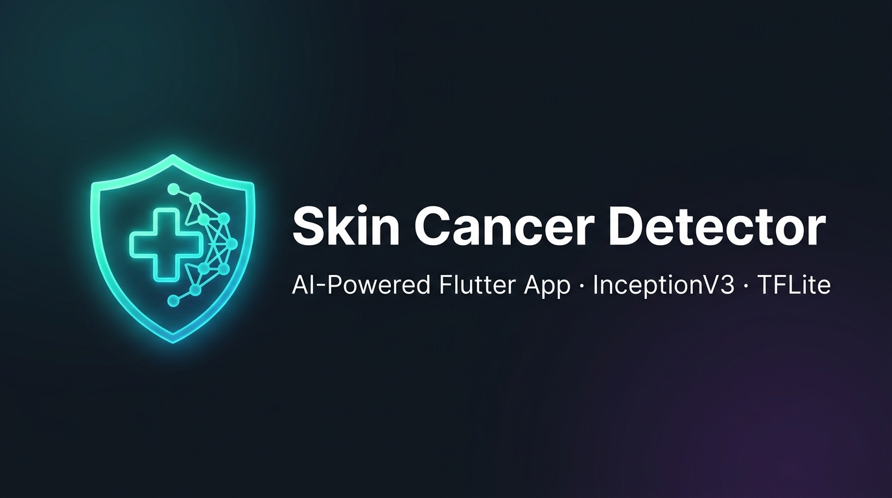

<p align="center">
  
</p>

<h1 align="center">🔬 Skin Cancer Detector</h1>

<p align="center">
  <b>AI-powered skin lesion analysis — right in your pocket.</b><br/>
  A Flutter mobile app that uses a fine-tuned InceptionV3 deep learning model to classify skin lesions as <i>Benign</i> or <i>Malignant</i> — entirely on-device via TensorFlow Lite.
</p>

<p align="center">
  
  
  
  
  
</p>

---

> ⚠️ **Medical Disclaimer** — This application is for **educational and research purposes only**. It is **not** a certified medical device and must **not** be used as a substitute for professional medical advice, diagnosis, or treatment. Always consult a qualified dermatologist.

---

## 📋 Table of Contents

- [Features](#-features)
- [Architecture](#-architecture)
- [AI Model](#-ai-model)
- [Dataset](#-dataset)
- [Project Structure](#-project-structure)
- [Getting Started](#-getting-started)
- [Model — Git LFS](#-model--git-lfs-important)
- [Training the Model](#-training-the-model)
- [Dependencies](#-dependencies)
- [Contributing](#-contributing)
- [License](#-license)

---

## ✨ Features

| Feature | Description |
|---|---|
| 📷 **Live Camera Capture** | Real-time camera preview with capture support |
| 🖼️ **Gallery Import** | Pick existing images from device gallery |
| 🤖 **On-Device Inference** | Runs 100% offline — no server, no API calls |
| 🔬 **Image Preprocessing** | Review & confirm image before analysis |
| 📊 **Confidence Score** | Animated confidence meter per prediction |
| 📁 **Scan History** | Persistent local history of all past scans |
| 💾 **Save & Share** | Save results to gallery or share with others |
| 🌙 **Dark Theme UI** | Premium dark glassmorphism design |
| ⚡ **Multi-threaded** | 4-thread TFLite interpreter for fast inference |

---

## 🏗️ Architecture

```
SkinCancerclassifier/
├── lib/
│   ├── main.dart                         # App entry point, splash, permissions
│   ├── theme/theme.dart                  # Global dark theme, colors, typography
│   ├── screens/
│   │   ├── home_screen.dart              # Landing — Camera / Gallery actions
│   │   ├── camera_screen.dart            # Live camera viewfinder + capture
│   │   ├── preprocessing_screen.dart     # Image review before inference
│   │   ├── result_screen.dart            # Prediction + confidence display
│   │   ├── history_screen.dart           # Saved scan history list
│   │   └── about_screen.dart             # App info & disclaimer
│   ├── services/
│   │   ├── skin_cancer_classifier.dart   # TFLite inference engine
│   │   └── scan_storage_service.dart     # Local JSON persistence
│   └── ai/
│       ├── skin_cancer_model.tflite      # Fine-tuned InceptionV3 (~85 MB)
│       └── labels_cancer.txt             # Class labels (Benign / Malignant)
```

### Data Flow

```
User Input (Camera / Gallery)
        │
        ▼
PreprocessingScreen
   ├─ Resize to 299×299 px
   └─ Normalize pixels [0.0, 1.0]
        │
        ▼
SkinCancerClassifier.classifyImage()
   ├─ TFLite Interpreter (4 threads)
   ├─ InceptionV3 forward pass
   └─ Sigmoid output → threshold @ 0.30
        │
        ▼
ClassificationResult { label, confidence, isCancerous }
        │
        ▼
ResultScreen → ScanStorageService (local persistence)
```

---

## 🤖 AI Model

Fine-tuned **InceptionV3** CNN, pre-trained on ImageNet and adapted for binary skin lesion classification on the HAM10000 dataset.

| Property | Value |
|---|---|
| **Base Architecture** | InceptionV3 (Google) |
| **Input Size** | 299 × 299 × 3 (RGB) |
| **Output** | Single sigmoid neuron (binary) |
| **Malignant Threshold** | ≥ 0.30 probability |
| **Export Format** | TensorFlow Lite (`.tflite`) |
| **Model Size** | ~85 MB |
| **Inference Threads** | 4 (configurable) |
| **Training Platform** | Google Colab (GPU) |

### Output Classes

| Label | Meaning |
|---|---|
| `Benign` | Non-cancerous — continue monitoring |
| `Malignant` | Potentially cancerous — consult a dermatologist |

### Malignant Diagnoses (HAM10000)

HAM10000 codes labeled **Malignant** during training:

- `mel` — Melanoma
- `bcc` — Basal Cell Carcinoma
- `akiec` — Actinic Keratoses / Intraepithelial Carcinoma

All others (`nv`, `bkl`, `df`, `vasc`) → **Benign**.

---

## 📂 Dataset

**HAM10000** — *Human Against Machine with 10000 training images*

> Tschandl, P., Rosendahl, C. & Kittler, H. *The HAM10000 dataset, a large collection of multi-source dermatoscopic images of common pigmented skin lesions.* Sci. Data **5**, 180161 (2018). https://doi.org/10.1038/sdata.2018.161

| Property | Detail |
|---|---|
| **Source** | [Harvard Dataverse](https://dataverse.harvard.edu/dataset.xhtml?persistentId=doi:10.7910/DVN/DBW86T) |
| **Images** | 10,015 dermatoscopic images |
| **Diagnoses** | mel, nv, bcc, akiec, bkl, df, vasc |
| **Metadata** | [`training/HAM10000_metadata.csv`](training/HAM10000_metadata.csv) |

---

## 📁 Project Structure

```
SkinCancerclassifier/                         ← Repo root (Flutter app)
├── README.md
├── LICENSE
├── .gitattributes                            ← Git LFS tracking rules
├── pubspec.yaml
├── analysis_options.yaml
│
├── training/                                 ← ML training resources
│   ├── SkinCancer_inceptionModel_fineTuning.ipynb  ← Google Colab notebook
│   └── HAM10000_metadata.csv                 ← Dataset metadata (10,015 records)
│
├── assets/
│   └── banner.jpg
│
├── lib/
│   ├── main.dart                             # Entry point, splash, permissions
│   ├── theme/theme.dart                      # Dark theme & color palette
│   ├── screens/
│   │   ├── home_screen.dart
│   │   ├── camera_screen.dart
│   │   ├── preprocessing_screen.dart
│   │   ├── result_screen.dart
│   │   ├── history_screen.dart
│   │   └── about_screen.dart
│   ├── services/
│   │   ├── skin_cancer_classifier.dart       # TFLite inference engine
│   │   └── scan_storage_service.dart         # Local JSON persistence
│   └── ai/
│       ├── skin_cancer_model.tflite          # Fine-tuned InceptionV3 (Git LFS)
│       └── labels_cancer.txt
├── android/
├── ios/
└── test/
```

---

## 🚀 Getting Started

### Prerequisites

| Tool | Version |
|---|---|
| [Flutter SDK](https://docs.flutter.dev/get-started/install) | ≥ 3.10.3 |
| [Dart SDK](https://dart.dev/get-dart) | ≥ 3.0 |
| Android Studio / Xcode | Latest stable |
| [Git LFS](https://git-lfs.github.com/) | Required for model download |

> A **physical device** is strongly recommended — camera features may not work on emulators.

### Installation

**1. Clone the repository**

```bash
git clone https://github.com/zashraf-io/SkinCancerclassifier.git
cd SkinCancerclassifier
```

**2. Pull the model via Git LFS**

```bash
git lfs pull
```

**3. Install dependencies**

```bash
flutter pub get
```

**4. Verify your environment**

```bash
flutter doctor
```

### Running the App

| Platform | Command |
|---|---|
| Android | `flutter run` |
| iOS (macOS) | `cd ios && pod install && cd .. && flutter run` |
| Release APK | `flutter build apk --release` |
| Release IPA | `flutter build ipa --release` |

---

## 📦 Model — Git LFS (Important!)

`lib/ai/skin_cancer_model.tflite` is **~85 MB** and is tracked via [Git Large File Storage](https://git-lfs.github.com/). Without Git LFS, cloners will get a pointer file instead of the actual model.

### One-time setup (already done in this repo)

```bash
git lfs install
git lfs track "*.tflite"
git add .gitattributes
git commit -m "chore: configure Git LFS for .tflite model"
```

### Push model to GitHub

```bash
git add lib/ai/skin_cancer_model.tflite
git commit -m "feat: add fine-tuned InceptionV3 TFLite model"
git push
```

> GitHub free accounts include **1 GB** of LFS storage and **1 GB/month** bandwidth. The model uses ~85 MB of that quota.

---

## 🧪 Training the Model

Full training pipeline: **[`training/SkinCancer_inceptionModel_fineTuning.ipynb`](training/SkinCancer_inceptionModel_fineTuning.ipynb)**

| Step | Description |
|---|---|
| 1 | Mount Google Drive & create project dirs |
| 2 | Download HAM10000 from Harvard Dataverse |
| 3 | Binary labeling: Malignant vs Benign |
| 4 | Stratified train / val / test split |
| 5 | Data augmentation (flip, rotation, zoom) |
| 6 | InceptionV3 + custom classification head |
| 7 | Phase 1: Train head only (frozen base) |
| 8 | Phase 2: Fine-tune top layers (low LR) |
| 9 | Evaluate: accuracy, AUC, confusion matrix |
| 10 | Export to TFLite (float32) |

[](https://colab.research.google.com/github/zashraf-io/SkinCancerclassifier/blob/main/training/SkinCancer_inceptionModel_fineTuning.ipynb)

---

## 📦 Dependencies

### Flutter / Dart

| Package | Version | Purpose |
|---|---|---|
| `camera` | ^0.11.0+2 | Live camera viewfinder |
| `tflite_flutter` | ^0.12.1 | On-device TFLite inference |
| `image` | ^4.3.0 | Image decoding & resizing |
| `image_picker` | ^1.0.7 | Gallery selection |
| `permission_handler` | ^12.0.1 | Camera & storage permissions |
| `path_provider` | ^2.1.5 | Temp directory for model |
| `google_fonts` | ^6.2.1 | Premium typography |
| `share_plus` | ^12.0.1 | Share results |
| `gal` | ^2.3.0 | Save to gallery |
| `uuid` | ^4.2.2 | Unique scan IDs |
| `intl` | ^0.20.2 | Date formatting |

### Python (Training Notebook)

| Package | Purpose |
|---|---|
| `tensorflow` / `keras` | Model training & TFLite export |
| `numpy`, `pandas` | Data manipulation |
| `Pillow` | Image processing |
| `scikit-learn` | Metrics & stratified splitting |
| `matplotlib` | Training curves & visualizations |

---

## 🤝 Contributing

Contributions are welcome!

1. **Fork** the repo
2. **Branch**: `git checkout -b feature/your-feature`
3. **Commit**: `git commit -m 'feat: add your feature'`
4. **Push**: `git push origin feature/your-feature`
5. **PR**: Open a pull request

### Roadmap / Open Issues

- [ ] Multi-class output (all 7 HAM10000 diagnoses)
- [ ] INT8 model quantization (smaller / faster)
- [ ] Grad-CAM saliency heatmaps
- [ ] PDF report export
- [ ] Multi-language support
- [ ] Web & desktop builds
- [ ] Unit & widget test suite

---

## 📄 License

MIT License — see [LICENSE](LICENSE) for full text.

---

## 🙏 Acknowledgements

- [HAM10000 Dataset](https://dataverse.harvard.edu/dataset.xhtml?persistentId=doi:10.7910/DVN/DBW86T) — Tschandl, Rosendahl & Kittler
- [TensorFlow Lite](https://www.tensorflow.org/lite) — On-device ML
- [InceptionV3](https://arxiv.org/abs/1512.00567) — Szegedy et al., Google
- [Flutter](https://flutter.dev/) — Google's cross-platform UI framework

---

<p align="center">Made with ❤️ for medical AI education</p>
<p align="center">
  <b>Cairo University</b> · Faculty of Engineering<br/>
  Systems &amp; Biomedical Engineering Department
</p>